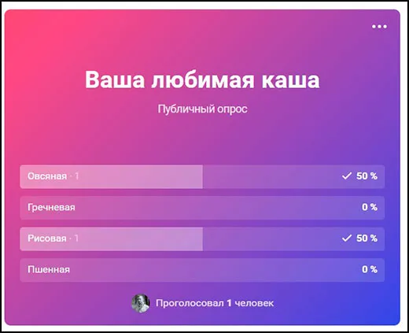

# 202306-ok-marketplace

Учебный проект курса
[Kotlin Backend Developer](https://otus.ru/lessons/kotlin/?int_source=courses_catalog&int_term=programming).
Поток курса 2023-06.

Vote -- система, предоставляющая возможность создавать голосование для чего-либо. Задача системы -- предоставить возможность
интегрировать в любую другую систему с любым набором подпунктов для верного подсчета голосов в реальном времени.

## Визуальная схема фронтенда

## Документация

1. Маркетинг
    1. [Заинтересанты](./docs/01-marketing/01-stakeholders.md)
    2. [Целевая аудитория](./docs/01-marketing/02-target-audience.md)
    3. [Конкурентный анализ](./docs/01-marketing/03-concurrency.md)
    4. [Анализ экономики](./docs/01-marketing/04-economy.md)
    5. [Пользовательские истории](./docs/01-marketing/05-user-stories.md)
2. DevOps
    1. [Схема инфраструктуры](./docs/02-devops/01-infrastruture.md)
    2. [Схема мониторинга](./docs/02-devops/02-monitoring.md)
3. Тесты
4. Архитектура
    1. [Компонентная схема](./docs/04-architecture/arch.png)
    2. [Интеграционная схема](./docs/04-architecture/integration.png)
    3. [Описание API](./docs/04-architecture/03-api.md)

# Структура проекта
