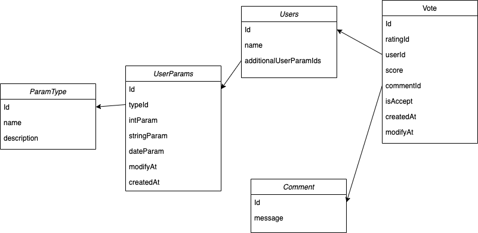

# API 

## MVP:
## Функции (эндпоинты)
1. CRUDS (create, read, update, delete, search)

## Описание сущности Vote
1. id - уникальный идентификатор голоса
2. ratingId - уникальный идентификатор объекта рейтингования
3. userId - уникальный идентификатор владельца голоса
4. score - оценка рейтинга
5. commentId - уникальный идентификатор комментария к голосу
5. isAccept - флаг, обозначающий, что голос учтен в рейтинге
6. createdAt - дата и время создания записи
7. updatedAt - дата и время обновления записи (данных)

## Описание сущности Users
1. id - уникальный идентификатор пользователя
2. name - ФИО пользователя

## Описание сущности Comment
1. id - уникальный идентификатор комментария
2. message - комментарий

## не MVP:
## Функции (эндпоинты)
1. CRUDS (create, read, update, delete, search)

## Описание сущности Vote
1. id - уникальный идентификатор голоса
2. ratingId - уникальный идентификатор объекта рейтингования
3. userId - уникальный идентификатор владельца голоса
4. score - оценка рейтинга
5. commentId - уникальный идентификатор комментария к голосу
6. isAccept - флаг, обозначающий, что голос учтен в рейтинге
7. createdAt - дата и время создания записи
8. updatedAt - дата и время обновления записи (данных)

## Описание сущности Users
1. id - уникальный идентификатор пользователя
2. name - ФИО пользователя
3. additionalUserParamIds - список уникальных идентификаторов допольнительной информации о пользователе

## Описание сущности UserParams
1. id - уникальный идентификатор параметра
2. typeId - уникальный идентификатор типа параметра
3. intParam - значение целочисленного параметра
4. stringParam - значение строкового параметра
5. dateParam - значение временного параметра
7. createdAt - дата и время создания записи
8. updatedAt - дата и время обновления записи (данных)

## Описание сущности Comment
1. id - уникальный идентификатор комментария
2. message - комментарий

